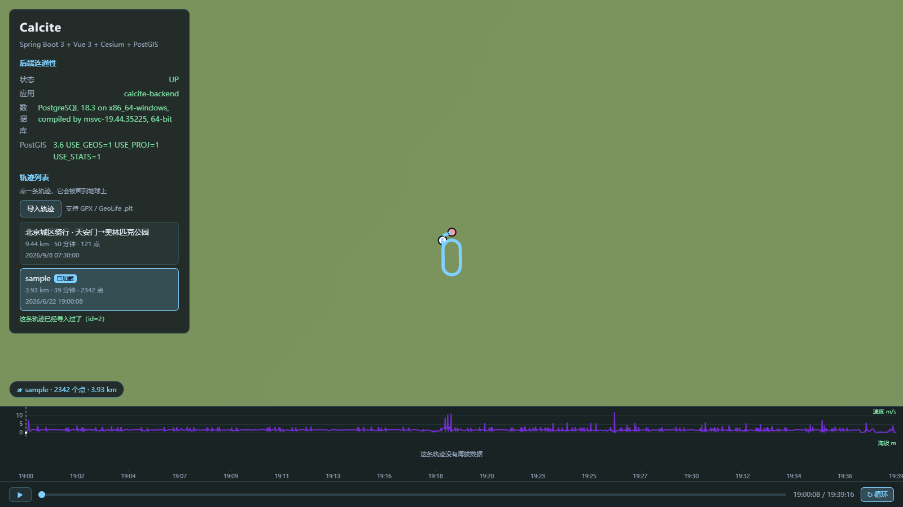
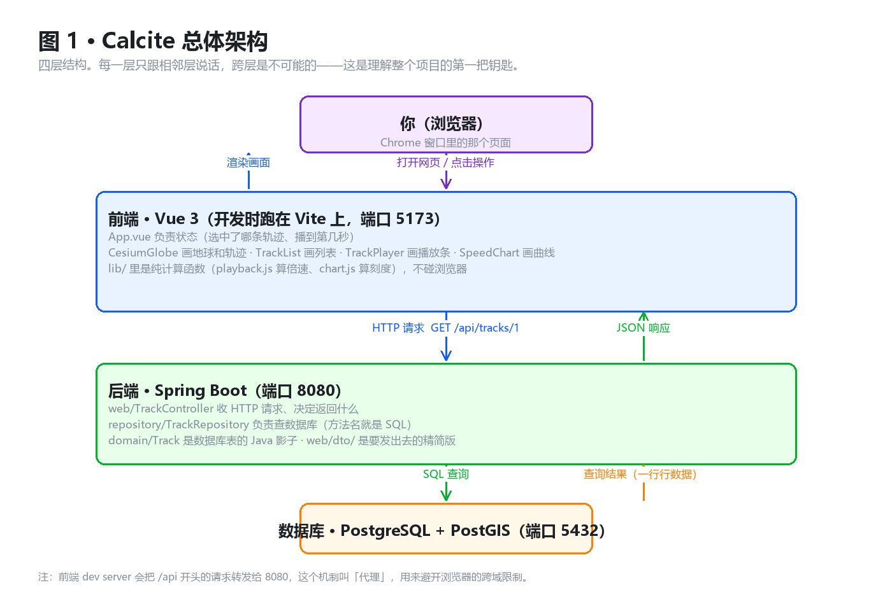

# Calcite · GPS 轨迹时空分析平台

> **一句话**：把 GPS 轨迹存进 PostGIS，用 Spring Boot 提供接口，在 Cesium 三维地球上回放，并逐步做时空分析。
>
> *A personal GPS trajectory analysis platform — PostGIS + Spring Boot 3 + Vue 3 + Cesium.*



*上图是 M1 完成时的实际界面：左侧导入并选中的是一条真实校园跑步轨迹（2342 个点 / 3.93 km / 39 分钟），
底部是速度曲线——中间两处尖刺是**真实存在的 GPS 漂移**，已被程序自动标记；海拔面板显示
「这条轨迹没有海拔数据」，因为数据源（手机运动 App）没有记录海拔。*

---

## 这是什么

一个**边做边学**的个人项目，目标是把"轨迹数据"这条链路完整走通：

```
原始轨迹（手机导出 / 公开数据集）
        ↓  导入：解析 → 清洗（标记 GPS 漂移）→ 入库
PostgreSQL + PostGIS（空间索引、时空联合索引）
        ↓  REST API
Spring Boot 3 后端
        ↓  HTTP / JSON
Vue 3 + Cesium 前端（三维回放 + 速度/海拔曲线 + 时空分析）
```

不是教程跟做，也不是现成模板改造——**设计文档、实施计划、单元测试、架构图都在仓库里**。

---

## 已完成的功能（M1 · 看得见）

| 功能 | 说明 |
| --- | --- |
| **轨迹导入（网页上传）** | 上传 GPX 文件，自动识别格式、解析、清洗、入库。**按文件内容识别格式，不看扩展名** |
| **轨迹导入（批量）** | 读取本地 GeoLife 数据集目录，批量灌入 `.plt` 轨迹（供大数据量演示） |
| **数据清洗** | 自动标记疑似 GPS 漂移点（**自适应阈值**，见下）；海拔缺失时归 NULL 而不是填 0 |
| **幂等导入** | 同一文件重复上传不会产生第二条轨迹（按**文件内容 SHA-256** 判重，改文件名也认得出） |
| **三维可视化** | Cesium 地球绘制轨迹线、起点/终点标记，相机自动飞到轨迹范围 |
| **时间轴回放** | 可变倍速播放（整条轨迹固定约 60 秒播完）、可拖动进度、循环开关、移动标记点 |
| **速度 / 海拔曲线** | 手写 SVG 双图，与回放游标**双向联动**：拖进度条曲线游标跟着走，点曲线能跳到那一刻；悬停显示该时刻读数 |
| **轨迹列表与详情** | 距离、时长、点数；支持 `?track=<id>` 深链接 |

### 数据清洗：为什么用自适应阈值

真实 GPS 数据一定脏。我那份 2342 个点的校园跑步数据里，有 **4 段速度超过 8 m/s，最高 12.13 m/s（43.7 km/h）**
——人跑不出这个速度，这是城市环境下的 GPS 漂移。

判定规则不是写死的阈值，而是：

```
异常段 = 速度 > max(8 m/s, 3 × 该轨迹速度的中位数)
```

**为什么不能用固定阈值**：GeoLife 数据集里包含**汽车（约 20 m/s）甚至火车（约 80 m/s）**的轨迹，
一刀切 8 m/s 会把它们全部误标。用中位数能让阈值**自动适应轨迹类型**：

| 轨迹类型 | 速度中位数 | 实际阈值 | 效果 |
| --- | --- | --- | --- |
| 校园跑步 | 1.63 m/s | 8.0 m/s | 12.13 m/s 那段被准确标出 |
| GeoLife 汽车 | ~12 m/s | 36 m/s | 正常行驶 20 m/s 不误标 |

实测在 2342 个点中**精确标记 8 个**（占 0.34%），位置与独立用 Python 复算的结果完全一致。

---

## 技术栈

| 层 | 技术 | 版本 |
| --- | --- | --- |
| 后端 | Spring Boot / Java / Maven | 3.5.16 / 25 / 3.9.11 |
| 持久层 | Spring Data JPA + Hibernate Spatial | 6.6.53.Final |
| 数据库 | PostgreSQL + PostGIS | 18.3 / 3.6 |
| 前端 | Vue 3 + Vite | 3.5.42 / 8.2.2 |
| 三维 | Cesium | 1.145.0 |
| 测试 | JUnit 5 + Mockito（后端）、Node 内置 assert（前端纯逻辑）、Playwright + Pillow（浏览器像素验收） | — |

**前端运行时依赖只有 `vue` + `cesium` 两个**——速度/海拔曲线是手写 SVG，没有引入任何图表库。

---

## 架构



| 层 | 职责 | 不该做的事 |
| --- | --- | --- |
| `web/` | 收 HTTP 请求、决定返回什么 | 不写 SQL |
| `service/` | 算法与编排（解析、清洗、导入流程） | 不碰 HTTP |
| `repository/` | 查/存数据库（方法名即 SQL） | 不碰 HTTP |
| `domain/` | 数据库表的 Java 影子 | 不认识前端 |

完整的目录结构、请求链路、分层理由都画在图里：
[项目结构地图](docs/learning/2026-09-10-calcite-structure-map.md)（7 张流程图）

---

## 快速开始

### 前置条件

- JDK 25、Maven 3.9+
- Node.js 20+
- PostgreSQL 18 + PostGIS 3.6（数据库名 `calcite`）

### 1. 建库建表

```bash
psql -U postgres -d calcite -f scripts/db/01-schema.sql   # 建表 + 索引（可重复执行）
psql -U postgres -d calcite -f scripts/db/02-sample-track.sql   # 灌一条示例轨迹
```

### 2. 配置数据库密码

```bash
cp backend/src/main/resources/application-local.yml.example \
   backend/src/main/resources/application-local.yml
# 然后编辑 application-local.yml，填入你的 PostgreSQL 密码
```

> `application-local.yml` 已在 `.gitignore` 里，不会被提交。

### 3. 启动后端（:8080）

```bash
mvn -f backend/pom.xml spring-boot:run
```

### 4. 启动前端（:5173）

```bash
cd frontend && npm install && npm run dev
```

打开 <http://localhost:5173>，点左侧轨迹列表里的任意一条即可看到回放和曲线；
点「导入轨迹」可以上传自己的 GPX 文件。

---

## 测试

```bash
# 后端单元测试（41 项）
mvn -f backend/pom.xml test

# 前端纯逻辑回归（17 + 37 项）
cd frontend && npm run check:playback && npm run check:chart
```

浏览器像素级验收脚本（需要前后端都在跑）：

```bash
python .tmp/check-import-pixels.py     # 导入功能
python .tmp/check-chart-pixels.py      # 曲线渲染
```

> **为什么要像素验收**：Cesium 的几何体在 Web Worker 里**异步**生成，
> 无头浏览器的虚拟时钟截图会在几何体就绪前就截，截出来是空白——
> 必须用真实浏览器 + 真实等待。这是踩过的坑，记在
> [结构地图的「已知的坑」一章](docs/learning/2026-09-10-calcite-structure-map.md)。

---

## 实现上值得一提的几个点

- **按文件内容识别格式**：手机导出的文件名是 `xxx.gpx.bin_tmp`，扩展名根本不对。判断格式看内容，不看后缀。
- **可插拔解析器 + 统一中间结构**：3 种格式 × 2 个入口，如果各写各的是 6 套代码；抽象出 `Importer` 接口和
  `RawPoint` 之后变成 **3 + 1**，清洗规则只写一份。
- **幂等**：导入前算文件内容的 SHA-256 判重，重复上传只会得到"已经导入过了"。
- **批量导入的事务边界**：Spring 的 `@Transactional` 靠代理生效，**类内部自调用不走代理**。批量导入若整批一个事务，
  一条坏数据会把后面全部拖垮——所以改成每个文件用 `TransactionTemplate` 单独开事务。
- **XXE 防护**：解析外部上传的 XML 时关闭外部实体，避免恶意文件读取服务器本地文件。
- **零依赖的图表**：手写 SVG，把"坐标映射 / 刻度算法 / 线性插值"当成纯函数抽到 `lib/`，可以用 Node 直接断言。

---

## 文档

这个项目的文档和代码是一起长的：

| 文档 | 内容 |
| --- | --- |
| [项目设计文档](docs/superpowers/specs/2026-09-08-calcite-trajectory-analysis-design.md) | 目标、范围、数据模型、接口清单、里程碑规划 |
| [项目结构地图](docs/learning/2026-09-10-calcite-structure-map.md) | 目录职责、请求链路、分层理由、7 张流程图、**踩过的坑** |
| [M1 导入功能设计](docs/superpowers/specs/2026-09-12-m1-import-design.md) | 接口定义、清洗规则、错误处理、验收标准 |
| [M1 导入实施计划](docs/superpowers/plans/2026-09-12-m1-import.md) | 12 个任务、69 个步骤、TDD、完整代码 |
| [学习笔记](docs/learning/) | 边做边学的知识点整理（PostGIS / Spring / Cesium / 真实数据清洗） |

---

## 已知限制

诚实地列出来：

- **离线底图在市区尺度是一片绿色**：Cesium 自带的 NaturalEarthII 底图分辨率低（好处是**不需要 token、不需要联网**）。
  后续计划加一个可切换的在线影像图层。
- **中国地区的 GCJ-02 偏移**：本项目的轨迹数据经实测确认是 **WGS84**（与 Cesium 一致，无需转换）。
  但如果接入高德/腾讯等 GCJ-02 数据源，需要做坐标转换。
- **GeoLife 数据集尚未导入**：批量导入接口已完成并用自造样本测试通过，
  等数据集下载完成后即可灌入 5-10 个用户（约百万点级）来演示大数据量。
- **没有做轨迹抽稀**：目前接口返回全部点。上万点的轨迹需要加 `?simplify=` 参数。

---

## 路线图

| 阶段 | 内容 | 状态 |
| --- | --- | --- |
| **M1 看得见** | 轨迹导入、列表详情、三维回放、速度/海拔曲线 | ✅ 完成 |
| **M2 算得出** | 停留点识别、轨迹统计（爬升/最高速）、热点区域网格分析 | 进行中 |
| **M3 讲得透** | 空间范围查询（画多边形查穿过的轨迹）、轨迹相似度（`ST_FrechetDistance`）、分析结果叠加到地球 | 计划中 |

---

## 关于

个人学习项目，目标是应聘 **GIS / 时空数据开发** 方向。

开发方式：先写设计文档 → 拆成带完整代码的实施计划 → TDD 实现 → 写回归测试 → 更新文档。
每个阶段的笔记都保留在 [`docs/learning/`](docs/learning/)。

> 项目名 **Calcite**（方解石）——一种在偏光下会呈现双折射的矿物。
