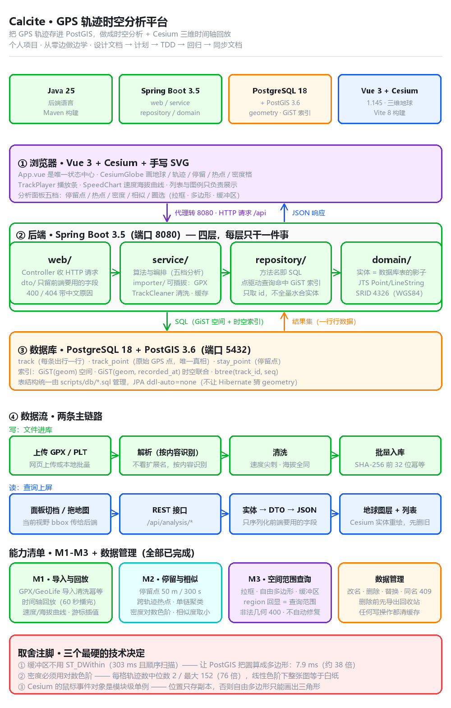
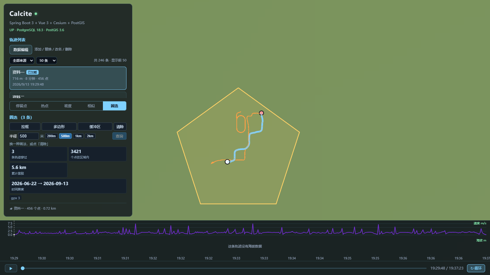
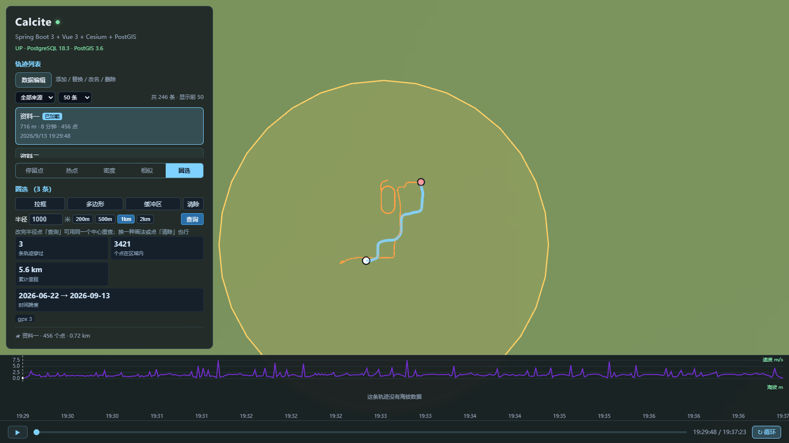
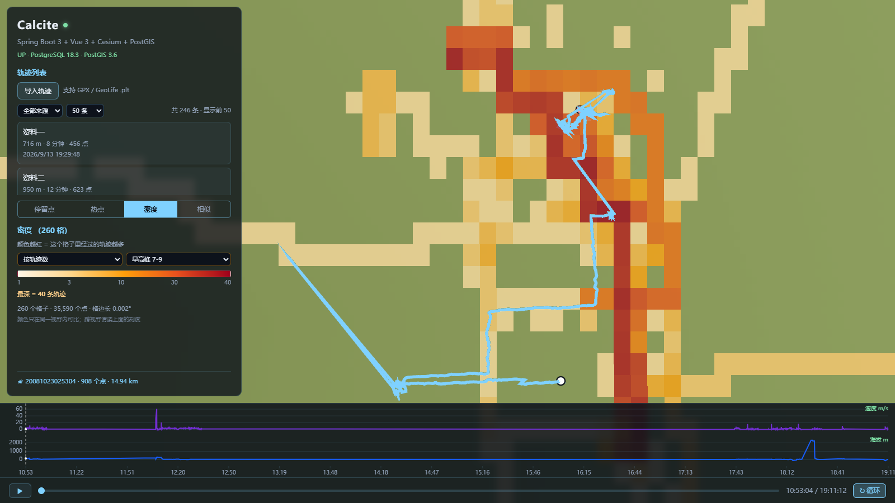
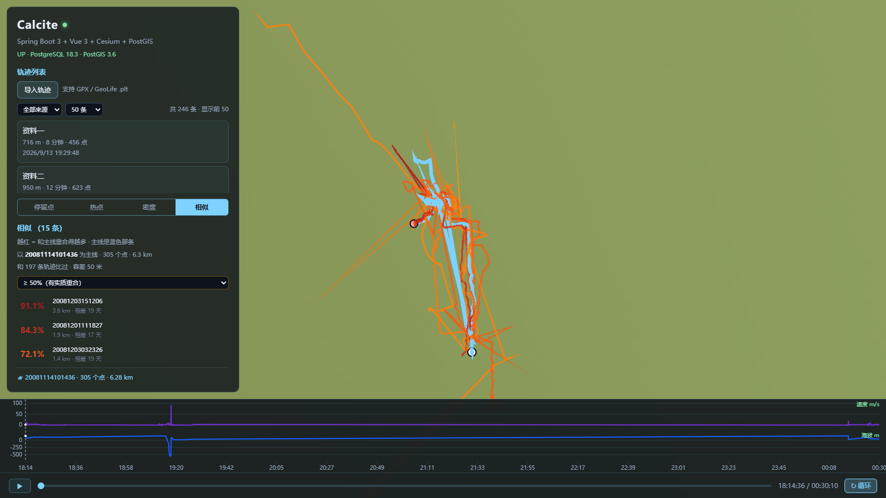
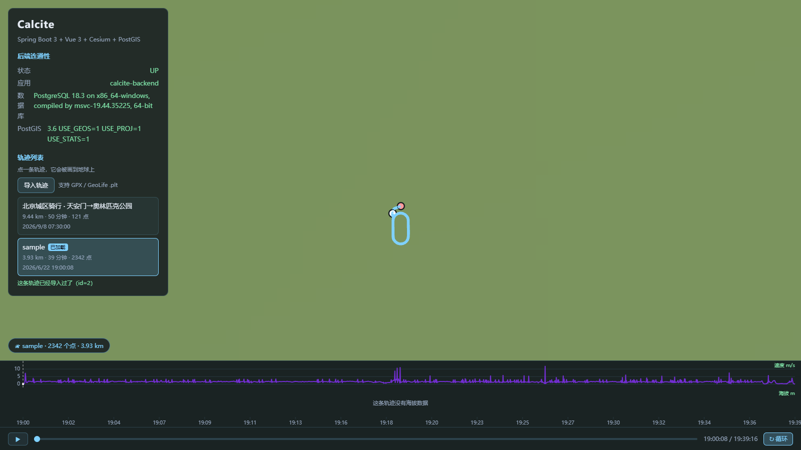
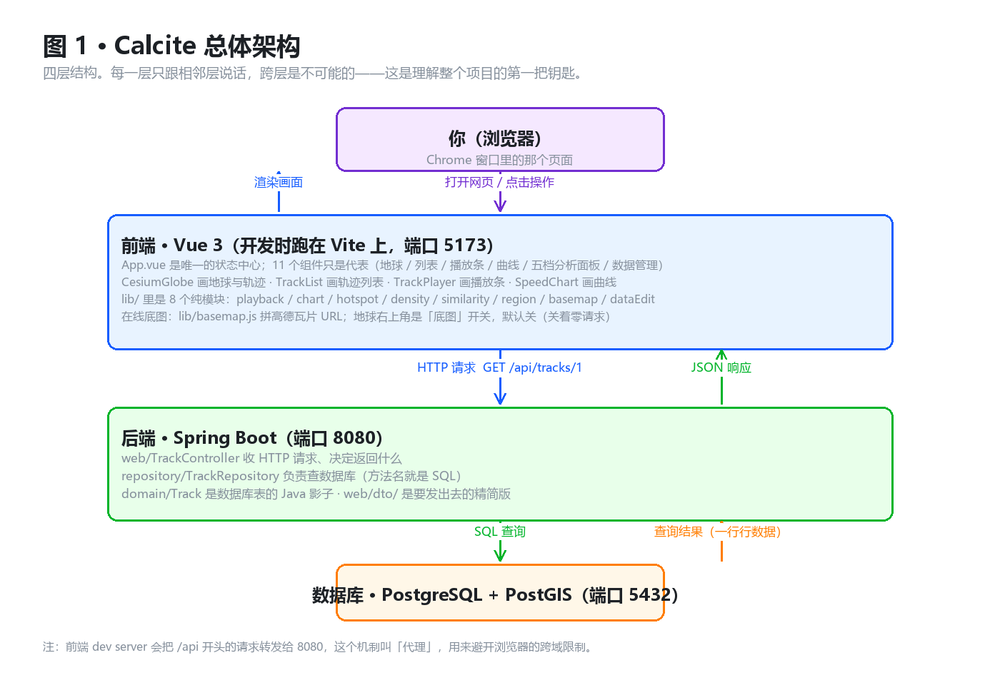

# Calcite · GPS 轨迹时空分析平台

> **一句话**：把 GPS 轨迹存进 PostGIS，用 Spring Boot 提供接口，在 Cesium 三维地球上回放，并逐步做时空分析。
>
> *A personal GPS trajectory analysis platform — PostGIS + Spring Boot 3 + Vue 3 + Cesium.*



---

## 这是什么

一个**边做边学**的个人项目，目标是把"轨迹数据"这条链路完整走通：

```
原始轨迹（手机导出 / 公开数据集）
        ↓  导入：解析 → 清洗（标记 GPS 漂移）→ 入库
PostgreSQL + PostGIS（空间索引、时空联合索引）
        ↓  REST API
Spring Boot 3 后端（web / service / repository / domain）
        ↓  HTTP / JSON
Vue 3 + Cesium 前端（三维回放 + 曲线 + 空间分析 + 圈选）
```

不是教程跟做，也不是现成模板改造——**设计文档、实施计划、单元测试、回归脚本、架构图都在仓库里**，
每个阶段的取舍都写了"为什么这么做、不用它行不行"（见 [技术要点自检](docs/learning/技术要点自检.md)）。

**当前数据量**：**246 条轨迹 / 286,019 个点**（GeoLIFE 北京 user 000、上海 user 001、京沪长途 3 条、自采 GPX 3 条）。

---

## 已实现的功能

### M1 · 看得见（导入与可视化）

| 功能 | 说明 |
| --- | --- |
| **轨迹导入（网页上传）** | 上传 GPX 文件，自动识别格式、解析、清洗、入库。**按文件内容识别格式，不看扩展名** |
| **轨迹导入（批量）** | 读取本地 GeoLife 数据集目录，批量灌入 `.plt` 轨迹 |
| **数据清洗** | 自动标记疑似 GPS 漂移点（**自适应阈值**，见下）；海拔缺失时归 NULL 而不是填 0 |
| **幂等导入** | 同一文件重复上传不会产生第二条轨迹（按**文件内容 SHA-256** 判重，改文件名也认得出） |
| **三维可视化** | Cesium 地球绘制轨迹线、起点/终点标记，相机自动飞到轨迹范围 |
| **时间轴回放** | 可变倍速播放（整条轨迹固定约 60 秒播完）、可拖动进度、循环开关、移动标记点 |
| **速度 / 海拔曲线** | 手写 SVG 双图，与回放游标**双向联动**；悬停显示该时刻读数 |
| **轨迹列表与详情** | 距离、时长、点数；支持 `?track=<id>` 深链接 |

### M2 · 算得出（四项时空分析）

| 功能 | 说明 | 关键取舍 |
| --- | --- | --- |
| **停留点识别** | 从轨迹里找出"人在哪停过、停了多久" | 半径 + 时长 + **断档**三个条件；阈值自适应 |
| **停留热点** | 把多次到访的停留点聚类成"热点"（点大小=次数，颜色=来过几条轨迹） | 聚类半径 200 m；**按 trackId 缓存停留点，缓存永不失效** |
| **网格密度** | 视野内的格网热力图，支持早/午/晚时段筛选 | **按视野裁剪**（全量最细档会有 75,970 格 / 3.3 MB）+ **对数色阶** |
| **轨迹相似度** | 给定一条轨迹，找出走向相似的其他轨迹（重合度 %） | 取 `min(正向, 反向)` 而不是平均；容差有上限 |

### M3 · 圈得准（空间范围查询）

| 功能 | 说明 | 关键取舍 |
| --- | --- | --- |
| **圈选（第五档）** | 在地球上**拉框 / 画自由多边形 / 点中心给半径**，立刻知道哪些轨迹穿过它、区域内有多少点、累计多长、跨越什么时间，并把命中轨迹叠在地球上 | 缓冲区由**后端算成圆多边形**再走同一条判定（7.9 ms，代替 `ST_DWithin` 的 303 ms）；`region` **回显后端真正用过的几何**；非法几何（自交）一律 400 而不是静默给错数字 |

### 数据管理

添加 / 替换 / 改名 / 删除都能在界面上做：删除**先导出 GeoJSON 到回收站再删库**（导出失败就不删）；
同名上传返回 409 让你选「替换 / 新增 / 取消」；任何写操作都会清掉相关缓存（相似度与停留点缓存）。

---

## 真实界面

圈选（五边形区域 + 命中轨迹 + 面板统计）：



缓冲区（半径 1 km，后端把圆算成多边形再判定）：



网格密度（同一座城市，早高峰 vs 全天）：



轨迹相似度：



M1 界面（回放 + 速度曲线，曲线中间的尖刺是真实存在的 GPS 漂移）：



---

## 技术栈

| 层 | 技术 | 版本 |
| --- | --- | --- |
| 后端 | Spring Boot / Java / Maven | 3.5.16 / 25 / 3.9+ |
| 持久层 | Spring Data JPA + Hibernate Spatial | 6.6.x |
| 数据库 | PostgreSQL + PostGIS | 18.3 / 3.6 |
| 前端 | Vue 3 + Vite | 3.5.42 / 8.2.2 |
| 三维 | Cesium | 1.145.0 |
| 测试 | JUnit 5 + Mockito（后端）、Node 内置 `assert`（前端纯逻辑）、Playwright + Pillow（浏览器像素验收） | — |

**前端运行时依赖只有 `vue` + `cesium` 两个**——速度/海拔曲线是手写 SVG，没有引入任何图表库。

---

## 架构



| 层 | 职责 | 不该做的事 |
| --- | --- | --- |
| `web/` | 收 HTTP 请求、决定返回什么 | 不写 SQL |
| `service/` | 算法与编排（解析、清洗、导入、空间分析） | 不碰 HTTP |
| `repository/` | 查/存数据库（方法名即 SQL，空间查询用 native SQL） | 不碰 HTTP |
| `domain/` | 数据库表的 Java 影子 | 不认识前端 |

完整的目录结构、请求链路、分层理由画在 7 张图里：
[项目结构地图](docs/learning/2026-09-10-calcite-structure-map.md)。

---

## 快速开始

### 前置条件

- JDK 25、Maven 3.9+
- Node.js 20+
- PostgreSQL 18 + PostGIS 3.6（数据库名 `calcite`）

### 1. 建库建表

```bash
psql -U postgres -d calcite -f scripts/db/01-schema.sql   # 建表 + 索引 + PostGIS 扩展（可重复执行）
psql -U postgres -d calcite -f scripts/db/02-sample-track.sql   # 灌一条示例轨迹
```

### 2. 配置数据库密码

```bash
cp backend/src/main/resources/application-local.yml.example \
   backend/src/main/resources/application-local.yml
# 然后编辑 application-local.yml，填入你的 PostgreSQL 密码
```

> `application-local.yml` 已在 `.gitignore` 里，不会被提交。

### 3. 启动后端（:8080）

```bash
mvn -f backend/pom.xml spring-boot:run
curl http://localhost:8080/api/health   # 期望返回数据库与 PostGIS 版本
```

### 4. 启动前端（:5173）

```bash
cd frontend && npm install && npm run dev
```

打开 <http://localhost:5173>（⚠️ 用 `localhost` 而不是 `127.0.0.1`：Vite 只绑 IPv6）。

**更详细的一步步部署（含常见报错排查）：[docs/DEPLOY.md](docs/DEPLOY.md)**

---

## 演示数据

没有数据也能马上看到效果——仓库里带一份**合成的演示数据集**（14 条轨迹，覆盖五个分析面板）：

```bash
psql -U postgres -d calcite -f scripts/db/04-demo-data.sql
```

导入后：停留点 / 热点 / 密度 / 相似度 / 圈选 每一档都有东西看（含一条带 GPS 漂移的轨迹、一条无海拔的轨迹、
三条多次到访同一广场造出的热点、两条互为相似第一名的通勤往返）。数据由 `scripts/demo/make-demo-data.py`
生成（**固定随机种子**，连跑两次输出字节一致）；清理只需 `DELETE FROM track WHERE external_id LIKE 'DEMO-%'`。

想要**真实大数据量**：从 [GeoLIFE 官网](https://www.microsoft.com/en-us/research/project/geolife-building-social-networks-using-human-location-history/)
下载数据集，再用批量导入接口灌入（路径必须在 `calcite.import.allowed-roots` 白名单内）。

---

## 测试与验收

四层回归，全部可重复执行（数字是 2026-09-27 的实测基线）：

```bash
# ① 后端单元测试（162 项，不需要数据库）
mvn -f backend/pom.xml test

# ② 前端纯逻辑回归（7 个套件 157 项，零依赖）
cd frontend
npm run check:playback && npm run check:chart && npm run check:hotspot && npm run check:density \
  && npm run check:similarity && npm run check:region && npm run check:data-edit
```

③ **浏览器像素级验收（8 个脚本 123 项）** 与 ④ **接口对拍（5 个脚本）** 在 `scripts/acceptance/`，
需要**后端 8080 + 前端 5173 同时在跑**；脚本清单与预期数字见该目录的 README。

> **为什么要像素验收**：Cesium 的几何体在 Web Worker 里**异步**生成，
> 无头浏览器的虚拟时钟截图会在几何体就绪前就截，截出来是空白——必须用真实浏览器 + 真实等待。
> 这是踩过的坑，记在[结构地图的「已知的坑」一章](docs/learning/2026-09-10-calcite-structure-map.md)。

生产构建：`cd frontend && npm run build`（1506 modules）。

---

## 实现上值得一提的几个点

- **按文件内容识别格式**：手机导出的文件名是 `xxx.gpx.bin_tmp`，扩展名根本不对。判断格式看内容，不看后缀。
- **可插拔解析器 + 统一中间结构**：3 种格式 × 2 个入口，如果各写各的是 6 套代码；抽象出 `Importer` 接口和
  `RawPoint` 之后变成 **3 + 1**，清洗规则只写一份。
- **幂等**：导入前算文件内容的 SHA-256 判重，重复上传只会得到"已经导入过了"。
- **批量导入的事务边界**：Spring 的 `@Transactional` 靠代理生效，**类内部自调用不走代理**。批量导入若整批一个事务，
  一条坏数据会把后面全部拖垮——所以改成每个文件用 `TransactionTemplate` 单独开事务。
- **XXE 防护**：解析外部上传的 XML 时关闭外部实体，避免恶意文件读取服务器本地文件。
- **零依赖的图表**：手写 SVG，把"坐标映射 / 刻度算法 / 线性插值"当成纯函数抽到 `lib/`，可以用 Node 直接断言。
- **缓存永不失效的前提是数据不可变**：停留点按 `trackId` 缓存，因为轨迹导入后只读；一旦有了删除 / 改名 / 替换，
  就必须显式 `invalidate`（数据管理阶段把这条欠账补上了）。
- **缓冲区不是"距离判断"**：`ST_DWithin(::geography)` 实测 303 ms 且用不上索引（瓶颈是逐顶点算椭球距离），
  改成"后端把圆算成多边形 + `ST_Intersects`"后 **7.9 ms**——而且让三种圈选形状共用同一条判定路径。
- **判据要能区分"做对了"和"什么都没发生"**：一个"多边形只能画三角形"的缺陷穿过了四层验收，
  因为每条断言只要求"查出了数字"；修完补的判据是"请求体里去掉重复点后有 4 个顶点"。

---

## 文档

这个项目的文档和代码是一起长的：

| 文档 | 内容 |
| --- | --- |
| [项目设计文档](docs/superpowers/specs/2026-09-08-calcite-trajectory-analysis-design.md) | 目标、范围、数据模型、接口清单、里程碑规划 |
| [部署文档](docs/DEPLOY.md) | 从零跑起来：数据库、配置、启动、演示数据、常见报错排查 |
| [项目结构地图](docs/learning/2026-09-10-calcite-structure-map.md) | 目录职责、请求链路、分层理由、7 张流程图、**踩过的坑** |
| [技术要点自检](docs/learning/技术要点自检.md) | 28 个技术点的"为什么这么做 / 不用它行不行 / 出处" |
| [各阶段设计文档](docs/superpowers/specs/) | M1 导入、M2 停留点 / 热点 / 密度 / 相似度、数据管理、M3 圈选、M4 收尾 |
| [各阶段实施计划](docs/superpowers/plans/) | 每个阶段的任务拆解、TDD 步骤、验收标准 |
| [学习笔记](docs/learning/) | 边做边学的知识点整理（PostGIS / Spring / Cesium / 真实数据清洗）+ 各阶段 Word 报告 |
| [验收脚本](scripts/acceptance/) | 浏览器像素验收、接口对拍、组件级桩测试 |

---

## 已知限制

诚实地列出来（每条都实测过，不是猜测）：

- **平面几何与球面距离的分歧**：3 条含超长边（>1000 km 的跳跃记录）的轨迹上最大差 **13.4 km**。
  改成球面判定就得放弃空间索引（回到 300 ms 级），**有意不修**，用测试钉住。
- **热点接口热态约 3.2 秒**：它每次要读 28.6 万个点，这部分不受缓存影响。
- **圈选的"区域内点数"统计 180~456 ms**：同一个 SQL，用绑定参数会走通用计划、多付一次外部排序落盘。
- **离线底图在市区尺度是一片绿色**：Cesium 自带的 NaturalEarthII 底图分辨率低（好处是**不需要 token、不需要联网**）。
- **中国地区的 GCJ-02 偏移**：本项目的轨迹数据经实测确认是 **WGS84**（与 Cesium 一致，无需转换）；
  接入高德 / 腾讯等 GCJ-02 数据源时需要做坐标转换。
- **没有做轨迹抽稀**：接口返回全部点。上万点的轨迹需要加 `?simplify=` 参数。
- **区域统计里没有"停留点数"**：加了会把接口从 0.2 s 拖到约 2.5 s，将来要做得走异步二段式。

---

## 路线图

| 阶段 | 内容 | 状态 |
| --- | --- | --- |
| **M1 看得见** | 轨迹导入、列表详情、三维回放、速度 / 海拔曲线 | ✅ 完成 |
| **M2 算得出** | 停留点识别、停留热点、网格密度、轨迹相似度 | ✅ 完成 |
| **数据管理** | 添加 / 替换 / 改名 / 删除（含回收站与缓存失效） | ✅ 完成 |
| **M3 圈得准** | 空间范围查询（拉框 / 多边形 / 缓冲区）+ 空间查询优化 + 路网匹配可行性评估 | ✅ 完成 |
| **M4 收尾** | README、架构图、部署文档、演示数据集、技术要点自检 | ✅ 完成 |

---

## 关于

个人项目，从零开始边做边学。

开发方式：先写设计文档 → 拆成带完整代码的实施计划 → TDD 实现 → 写回归测试 → 更新文档。
每个阶段的笔记都保留在 [`docs/learning/`](docs/learning/)。

> 项目名 **Calcite**（方解石）——一种在偏光下会呈现双折射的矿物。

## 许可

[MIT](LICENSE) © 2026 YNM10086
